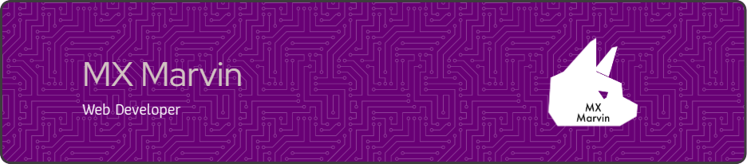

- 🤪 About Me
  - My name is Jorden, I am a COO for Backwoods Hosting, and I am the Founder and CEO of MX Marvin.
  - I am learning Laravel Framework, PHP, Vue, React, and TailwindCSS.
  - In the future I intend to learn C++ and C# and other languages.

  

